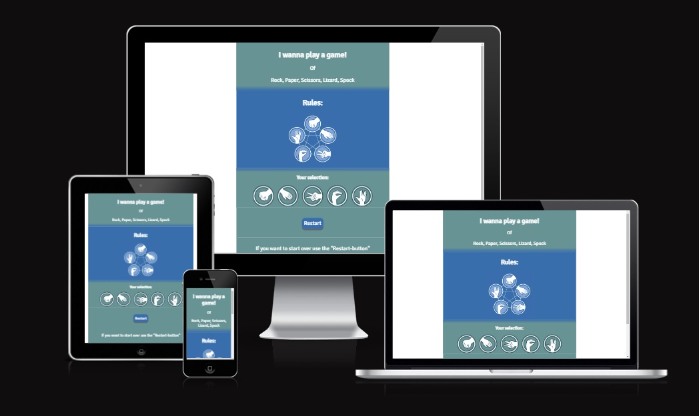
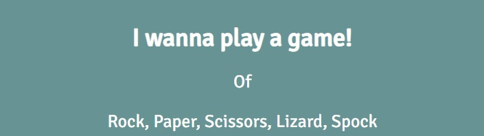
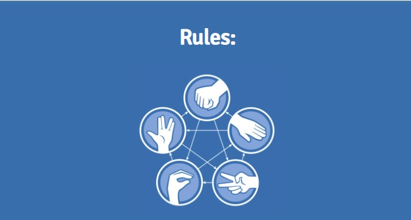
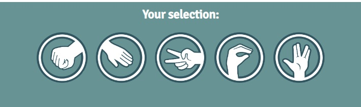
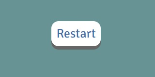
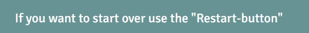
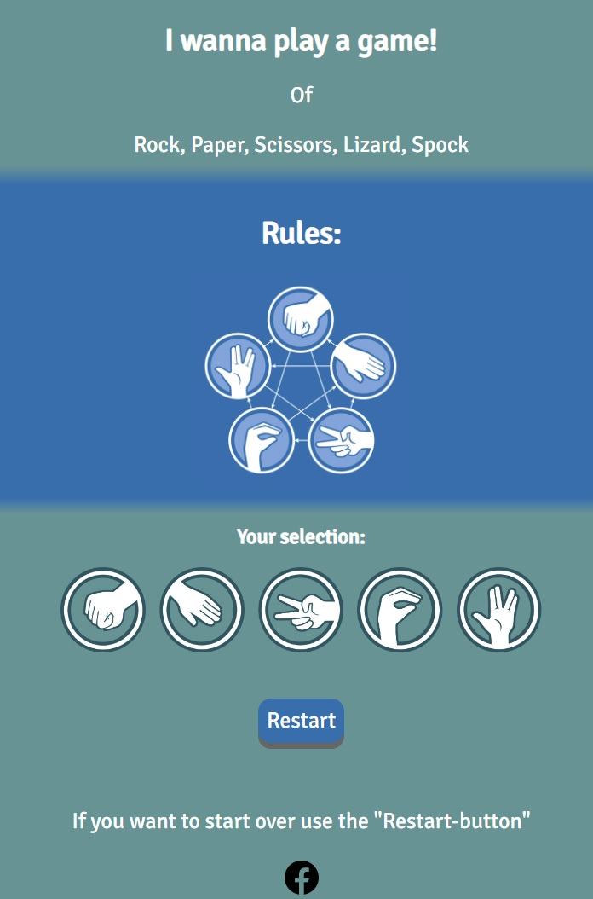

# Game of Rock, Paper, Scissor, Lizard, Spock!

This project is a fun game that will let you have a good time while working.

For example; Sometimes you just won´t get your head around problems or thougts, thats when this game come in handy.

## Features 

In this section, you should go over the different parts of your project, and describe each in a sentence or so. You will need to explain what value each of the features provides for the user, focusing on who this website is for, what it is that they want to achieve and how your project is the best way to help them achieve these things.

### Existing Features

- __Header__

  - Thought it was fun to implement a text of "I wan´t to play a game" (the quote is from the saw movies).
  - Then a small text of the game content, I want to keep it very simple with the coice of this layout, focus should be on the game. 

- __Rules__
 
  - Thought of having a videoclip here with Sheldon from big bang theory explaining the game, but that seemed a little too much for this design.
  - Chose to have a blue background to make the picture blend in. 

- __Selection-section__

  - This section invites you to pick a "sign" of choice. 
  - When picked, the game will start. 

- __Score-section__

  - This section will appear when the game is played. 
  - It will keep track of you score against the computer, you get +1 point for wins, 0 points for draw, and -1 if you loose. 
  - I made it so you won´t see the computers score, what matters is you!

- __Restart button__ 

  - This button will restart the game. 
  - If you wanna be the first one to 100 points, you may want to start over if you on the minus side.
  - When you hover over this it changes color, when you press it changes again.

  

- __Footer__

  - Wrote a small text that explains how to restart the game. 
  - There´s a facebook icon with a small opacity change when hovered ( links to my facebook page). 

-__The Game__

- This is the game design I come up with.

### Features Left to Implement

- Graphics that make your choice vs computers choice to move the classic rock,paper,scissor motion then show results.

## Testing 

I´ve tried this a very large number of times even my friends have played it.
The feedback I usually get is that it´s a nice time consuming game, in the future I should implement some more cool javascripts.

I´ve encountered some small bugs like the scissors wasn´t able to draw because I misspelled the word scissors in my Javascript, I missed the "s" on the end.
When played on mobile-device the "restart-game" button stays white when pushed, but returns to the right color when you push the "sign-buttons".
The "sign-buttons" hover over effect dosen´t work on the mobile device, because you won´t hover with your fingers :) (so not a bugg but not same as browser)

### Validator Testing 

- HTML
  - No errors were returned when passing through the official [W3C validator](https://validator.w3.org/nu/?doc=https%3A%2F%2F8000-leetzner-javagame-3xh7i4hhhuz.ws-eu72.gitpod.io%2F)
- CSS
  - No errors were found when passing through the official [(Jigsaw) validator](https://jigsaw.w3.org/css-validator/validator?uri=https%3A%2F%2F8000-leetzner-javagame-3xh7i4hhhuz.ws-eu72.gitpod.io%2F&profile=css3svg&usermedium=all&warning=1&vextwarning=&lang=sv)

### Unfixed Bugs

The computer score dosen´t count, this is not a real bug, I just left it out because I think it ruins my design (the score still counts but dosen´t show up).

## Deployment

This section should describe the process you went through to deploy the project to a hosting platform (e.g. GitHub) 

- The site was deployed to GitHub pages. The steps to deploy are as follows: 
  - In the GitHub repository, navigate to the Settings tab 
  - From the source section drop-down menu, select the Master Branch
  - Once the master branch has been selected, the page will be automatically refreshed with a detailed ribbon display to indicate the successful deployment. 

The live link can be found here - https://leetzner.github.io/Java-Game/

## Credits 

I got a great deal of help with the javascript for the game from the "Clever Programmer" on youtube.
I´ve used his code to build on and implemented my own thought of how I wanted the game to work.

Found a picture that explains the game from Steam (https://steamcommunity.com/sharedfiles/filedetails/?id=798194678).
Icons to the buttons are downloaded from (https://rwest88.github.io/Rock-Paper-Scissors/)
Icon to facebook is downloaded from (https://icons8.com/icons/set/facebook) 
